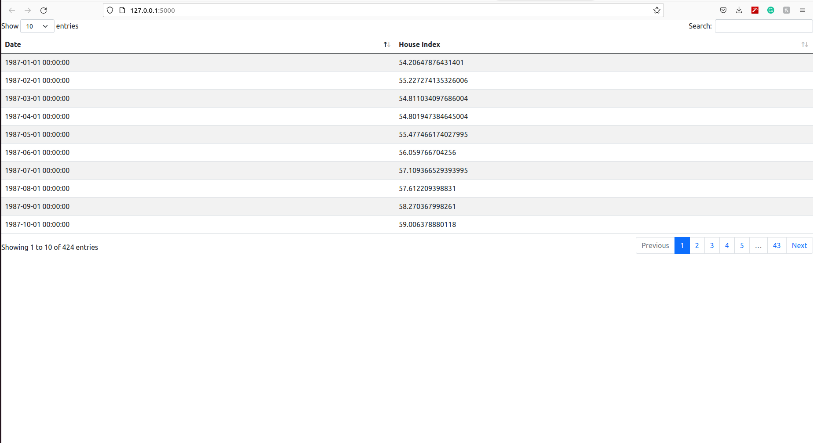
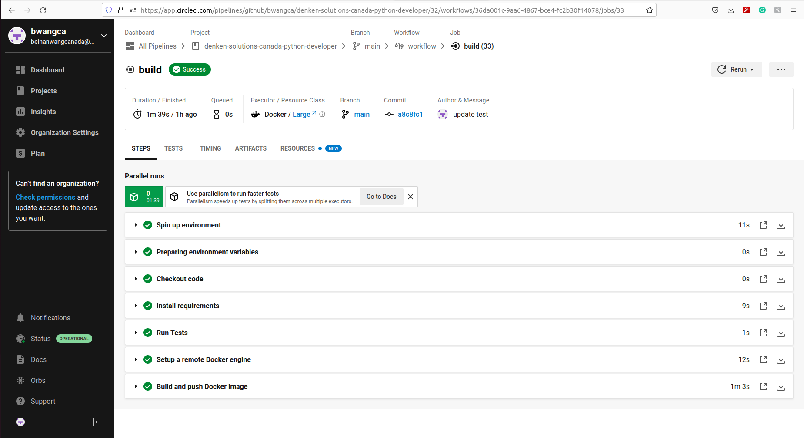

# Intorudction
This is a very simple project to demonstrate the required skills for the job **Python Developer-Remote** posted by **Denken Solutions Canada Inc**. This project is a **RESTful web application** created using the **Flask** framework. It uses **Pandas** to retrieve Chicago Home Price Index from a [website](https://fred.stlouisfed.org/series/CHXRSA) and then writes the data to a **NoSQL** database hosted by **MongoDB Atlas**. Users can view the data by sending an **HTTP** request and the REST API will then display the data as a table on a webpage.

This simple app uses **OOP** design pattern (e.g., **abstract class** and **inheritance**) whenever it is appropriate. It also supports **CI/CD** with **CircleCI**. The **CircleCI** routine automatically runs **tests**. If the tests are successful, a **Docker** image is built and pushed to **Docker Hub**.

# Usage
1. Run ```pip3 install -r requirements.txt``` to install the required packages
2. Run ```python3 setup.py``` once to populate the remote database (optional, because it has been done by me)
3. Run ```flask run``` to start the app
4. Go to ```http://127.0.0.1:5000``` to view the data
